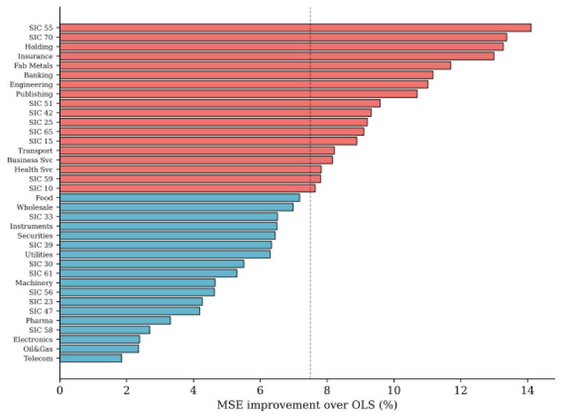
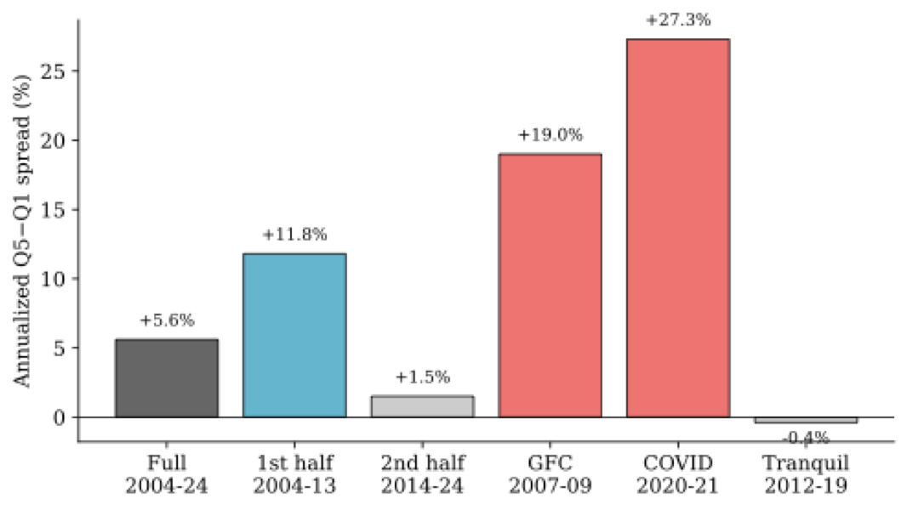
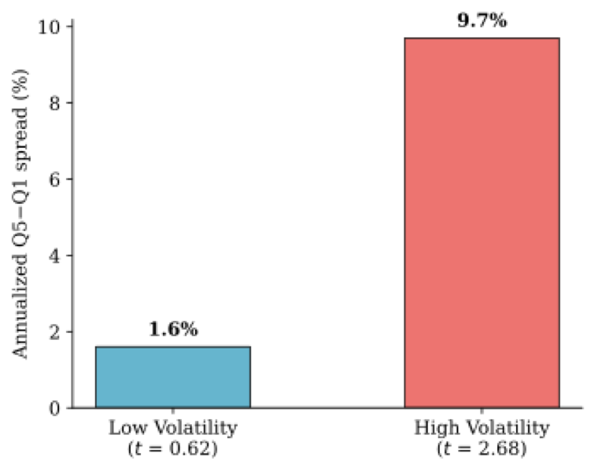
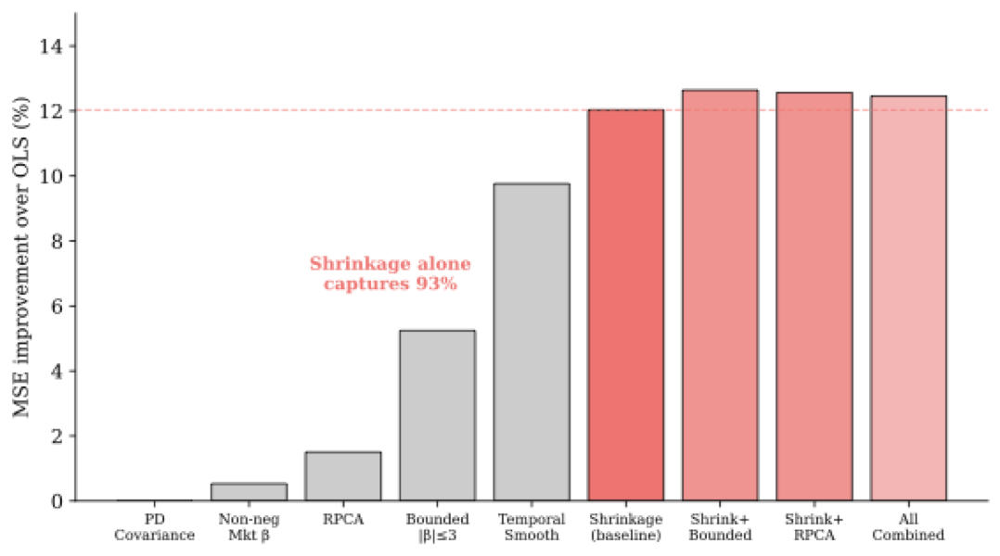

# The Shape of Beta: Industry Factor Structure and Crisis Risk Premium

[](https://doi.org/10.5281/zenodo.18877400)

Replication code for **"The Shape of Beta: Industry Factor Structure and Crisis Risk Premium"** (Woo & Kim, 2026), submitted to the *Journal of Financial Stability*.

---

## Key Findings

### 1. Industry-level shrinkage universally improves beta estimation

Shrinking firm-level OLS betas toward the industry mean reduces out-of-sample prediction error in **all 36 industries** tested, with an average improvement of **+7.5%**. The improvement scales with factor model richness: CAPM (+2.3%) < FF3 (+5.0%) < FF5 (+7.5%).



### 2. Beta deviation earns a crisis risk premium

Stocks whose factor exposures deviate from the industry norm earn higher returns—but only during periods of market stress. The quintile spread is **+19.0%/year during the GFC** and **+27.3%/year during COVID-19**, but statistically zero in tranquil markets.



### 3. The signal is real-time observable and survives controls

Conditioning on trailing market volatility (a real-time proxy for the VIX), the spread is **+9.7%/year in high-volatility months** (t = 2.68) and zero in calm months. The signal survives controls for firm size, idiosyncratic volatility, and momentum (t = 3.81), and is strongest in **large-cap stocks** (t = 4.42).



### 4. Simple shrinkage captures 97% of achievable gains

We test five economically motivated constraints (positive definite covariance, non-negative market beta, bounded betas, RPCA decomposition, temporal smoothness). The best combination improves upon simple shrinkage by only 0.4 percentage points. Simple shrinkage captures ~97% of the total achievable improvement.



---

## Implications

**For researchers:** Industry-level cross-sectional structure in factor exposures is a robust empirical regularity that the beta estimation literature has overlooked. The crisis risk premium raises questions about state-dependent pricing of within-industry heterogeneity.

**For practitioners:** Blending firm-level OLS betas with the industry mean is a zero-cost improvement to cost of capital estimation, portfolio construction, and risk management. The beta deviation measure identifies firms likely to behave atypically during stress.

**For regulators:** Within-sector heterogeneity in factor exposures is an important source of variation in crisis-period outcomes that standard sector-level stress tests may miss. The beta deviation measure could complement existing systemic risk indicators.

---

## Replication

### Requirements

- Python 3.9+
- WRDS account (for CRSP, Audit Analytics, Fama-French data)
- Packages: `wrds`, `pandas`, `numpy`, `scipy`, `matplotlib`

```bash
pip install wrds pandas numpy scipy matplotlib
```

### Step 1: Download data from WRDS

```bash
python code/00_download_wrds_data.py
```

This downloads CRSP monthly returns, Fama-French 5-factor returns, and SIC codes from Audit Analytics. You will be prompted for your WRDS credentials. Output is saved to `data/`.

### Step 2: Run all experiments

```bash
python code/01_run_experiments.py
```

Reproduces all results (Tables 1–12). Output:
- `results/master_verification.json` — all numbers in the paper
- `results/constrained_results.json` — Table 12 (constrained estimation)

Runtime: ~40 seconds on a modern laptop.

### Step 3: Generate figures

```bash
python code/02_generate_figures.py
```

Generates all 9 figures in `figures/`.

---

## Repository Structure

```
├── code/
│   ├── 00_download_wrds_data.py   # WRDS data download
│   ├── 01_run_experiments.py      # All experiments (Tables 1-12)
│   └── 02_generate_figures.py     # All figures (Figs 1-9)
├── data/                          # Raw data (not included; download via Step 1)
│   └── README.md
├── results/                       # JSON results (generated by Step 2)
├── figures/                       # PDF figures (generated by Step 3)
├── LICENSE
└── README.md
```

## Data

Raw data from CRSP and Audit Analytics cannot be redistributed due to WRDS licensing. Use `code/00_download_wrds_data.py` with a valid WRDS account to obtain the data. The Fama-French factors are publicly available from [Kenneth French's data library](https://mba.tuck.dartmouth.edu/pages/faculty/ken.french/data_library.html).

## Citation

```bibtex
@article{woo2026shape,
  title={The Shape of Beta: Industry Factor Structure and Crisis Risk Premium},
  author={Woo, Jihwan and Kim, Nari},
  journal={Journal of Financial Stability},
  year={2026},
  note={Under review}
}
```

## License

MIT License. See [LICENSE](LICENSE) for details.
